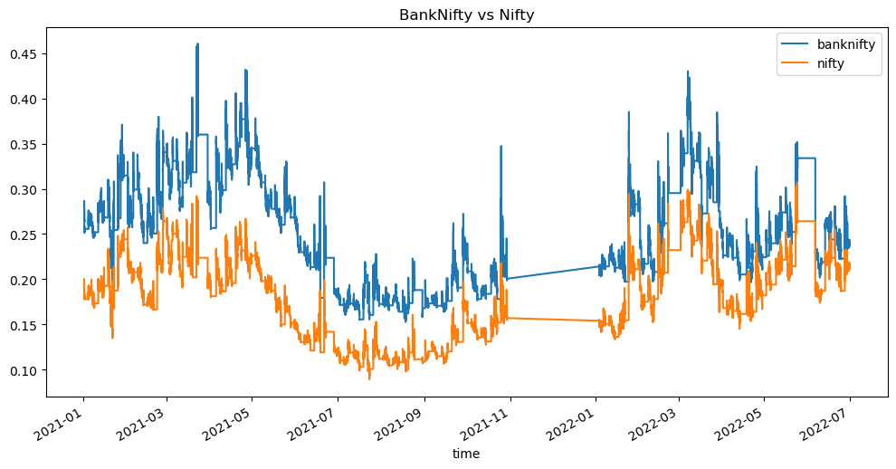

# **Spread Z-Score** - Statistical Arbitrage Strategy

This project explores a **statistical arbitrage strategy based on the spread of implied volatility (IV) between BankNifty and Nifty options**.
The objective is to identify **temporary deviations in the volatility relationship** between the two indices and exploit them using a **Z-Score based mean-reversion strategy**.

  

##  Problem Statement

BankNifty and Nifty are highly related indices in the Indian equity market. Since banking stocks have a large weight in the broader market, the **implied volatility (IV) of BankNifty and Nifty options tends to move together over time**.

However, due to:

* market microstructure noise
* sector-specific news
* liquidity imbalances
* temporary demand/supply shocks

their implied volatilities can **temporarily diverge**. These deviations create opportunities for **statistical arbitrage**.

The key challenge is to **identify when the spread between the two volatilities is abnormally large or small relative to its typical behavior**.

## Solution Approach

To detect abnormal deviations in the volatility spread $Spread_t = IV_{BankNifty,t} - IV_{Nifty,t}$ , this project uses a **Z-Score based statistical arbitrage strategy**.
Note: Spread represents the **relative volatility premium between the two indices**.

To determine whether the spread is unusually high or low, it is standardized using a **Z-score**:
$$Z_t = \frac{Spread_t - \mu}{\sigma}$$

Where:
* $\mu$ = mean spread
* $\sigma$ = standard deviation of spread

The Z-score measures **how many standard deviations the current spread is away from its typical level**.

### Z-Score Strategy Logic

The strategy assumes that the spread between the two indices **mean-reverts over time**.

|  Condition   |        Interpretation          | Trading Action |
| ------------ | ------------------------------ | -------------- |
|  $Z > +1$  |      Spread unusually high     | Short spread   |
|  $Z < -1$  |      Spread unusually low      | Long spread    |
| $\|Z\| < 0.25$| Spread returned to equilibrium | Exit position  |

This approach ensures that trades are only executed when the spread shows **statistically significant deviations**, reducing noise-driven signals.

### Project Content

- 1. Data Cleaning
- 2. Exploratory Data Analysis (EDA)
- 3. Statistical Analysis
- 4. Strategy Framework (Planned)

## Exploratory Data Analysis (EDA)

The EDA phase focuses on understanding the **statistical relationship between BankNifty IV and Nifty IV**.

Key steps include:
* plotting time series of implied volatility
* analyzing the spread distribution
* studying spread behavior across time - **Z-score plots**, **spread time series plots**
* detecting extreme deviations using Z-scores  - **density plots (hexbin and KDE)**, **distribution analysis**

### Conclusion from EDA

The exploratory analysis reveals several important insights:
- **Strong Relationship Between Indices:** BankNifty and Nifty implied volatilities move closely together, confirming a strong **market linkage**.
- **Stable Spread Behavior:** Spread between the two volatilities remains **bounded within a stable range**, suggesting a consistent relationship.
- **Rare Extreme Deviations:** Most spread observations lie close to their mean, while **extreme deviations occur occasionally**. These rare events represent `potential statistical arbitrage opportunities`.
- **Intraday Regime Changes:** Spread behavior varies across time, with different **volatility regimes during the trading day**. Local normalization (hourly Z-scores) helps account for these regime shifts.

## **Z-Score Strategy (Upcoming Implementation)**

The next stage of the project will implement the **Spread Z-Score trading strategy**.

The strategy will:

1. Monitor the IV spread between BankNifty and Nifty
2. Compute Z-scores using rolling windows
3. Generate trading entry and exit signals when spreads deviate significantly
4. enter when **spread diverges** and exit trades once spreads **revert toward equilibrium**

Performance will be evaluated using:
* cumulative PnL
* trade frequency
* drawdown analysis
* comparison with baseline strategies

