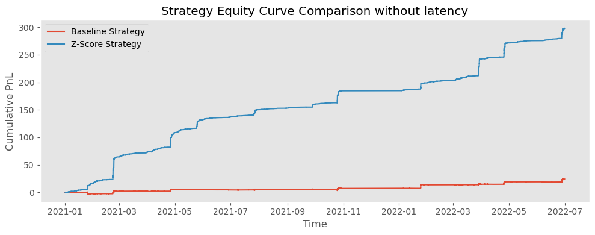
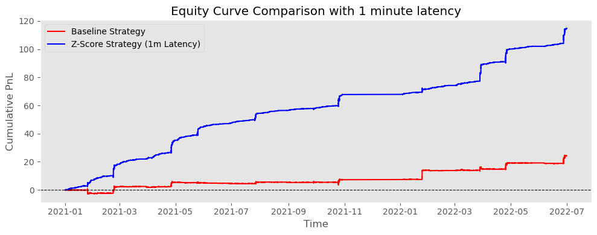

# **Spread Z-Score** - Statistical Arbitrage Strategy

This project explores a **statistical arbitrage strategy based on the spread of implied volatility (IV) between BankNifty and Nifty options**.
The objective is to identify **temporary deviations in the volatility relationship** between the two indices and exploit them using a **Z-Score based mean-reversion strategy**.

  

##  Problem Statement

BankNifty and Nifty are highly related indices in the Indian equity market. Since banking stocks have a large weight in the broader market, the **implied volatility (IV) of BankNifty and Nifty options tends to move together over time**.

However, due to:

* market microstructure noise
* sector-specific news
* liquidity imbalances
* temporary demand/supply shocks

their implied volatilities can **temporarily diverge**. These deviations create opportunities for **statistical arbitrage**.

The key challenge is to **identify when the spread between the two volatilities is abnormally large or small relative to its typical behavior**.

## Solution Approach

To detect abnormal deviations in the volatility spread $Spread_t = IV_{BankNifty,t} - IV_{Nifty,t}$ , this project uses a **Z-Score based statistical arbitrage strategy**.
Note: Spread represents the **relative volatility premium between the two indices**.

To determine whether the spread is unusually high or low, it is standardized using a **Z-score**:
$$Z_t = \frac{Spread_t - \mu}{\sigma}$$

Where:
* $\mu$ = mean spread
* $\sigma$ = standard deviation of spread

The Z-score measures **how many standard deviations the current spread is away from its typical level**.

### Z-Score Strategy Logic

The strategy assumes that the spread between the two indices **mean-reverts over time**.

|  Condition   |        Interpretation          | Trading Action |
| ------------ | ------------------------------ | -------------- |
|  $Z > +1$  |      Spread unusually high     | Short spread   |
|  $Z < -1$  |      Spread unusually low      | Long spread    |
| $\|Z\| < 0.25$| Spread returned to equilibrium | Exit position  |

This approach ensures that trades are only executed when the spread shows **statistically significant deviations**, reducing noise-driven signals.

## Exploratory Data Analysis (EDA)

The EDA phase focuses on understanding the **statistical relationship between BankNifty IV and Nifty IV**.

Key steps include:
* plotting time series of implied volatility
* analyzing the spread distribution
* studying spread behavior across time - **Z-score plots**, **spread time series plots**
* detecting extreme deviations using Z-scores  - **density plots (hexbin and KDE)**, **distribution analysis**

### Conclusion from EDA

The exploratory analysis reveals several important insights:
- **Strong Relationship Between Indices:** BankNifty and Nifty implied volatilities move closely together, confirming a strong **market linkage**.
- **Stable Spread Behavior:** Spread between the two volatilities remains **bounded within a stable range**, suggesting a consistent relationship.
- **Rare Extreme Deviations:** Most spread observations lie close to their mean, while **extreme deviations occur occasionally**. These rare events represent `potential statistical arbitrage opportunities`.
- **Intraday Regime Changes:** Spread behavior varies across time, with different **volatility regimes during the trading day**. Local normalization (hourly Z-scores) helps account for these regime shifts.

# Results

The performance of the **Z-Score Mean Reversion Strategy** is compared with a **baseline spread strategy** to evaluate whether statistical normalization improves trading performance.

## Without Execution Latency

| Strategy                        | Total PnL  | Sharpe Ratio | Max Drawdown | Approx Trades |
| ------------------------------- | ---------- | ------------ | ------------ | ------------- |
| Baseline Spread Strategy        | 24.23      | 1.73         | -3.76        | 310           |
| Z-Score Mean Reversion Strategy | **297.95** | **4.35**     | **-0.98**    | 5413          |

* The **Z-Score strategy significantly outperforms the baseline strategy**.
* Total profit increases from **24 → ~298**, representing more than a **12× improvement**.
* The **Sharpe ratio improves from 1.73 to 4.35**, indicating far better **risk-adjusted performance**.
* The **maximum drawdown decreases substantially**, suggesting **more stable returns**.
* The Z-Score strategy executes **more trades**, reflecting the frequent opportunities created by spread mean-reversion.

The equity curve also shows **consistent growth over time**, whereas the baseline strategy produces relatively modest profits.

## With 1-Minute Execution Latency

| Strategy                      | Total PnL  | Sharpe Ratio | Max Drawdown | Approx Trades |
| ----------------------------- | ---------- | ------------ | ------------ | ------------- |
| Baseline Strategy             | 24.23      | 1.73         | -3.76        | 310           |
| Z-Score Strategy (1m Latency) | **114.76** | **5.07**     | -2.85        | 5400          |

* Profitability **decreases from ~298 to ~115** after introducing execution latency.
* This confirms that **execution delays reduce arbitrage efficiency**.
* Despite the reduction, the **Z-Score strategy still significantly outperforms the baseline strategy**.
* The Sharpe ratio remains **strong at 5.07**, indicating **robust risk-adjusted returns** even with latency.
* The strategy continues to exploit spread deviations effectively under more realistic trading conditions.

The latency-adjusted equity curve still shows **steady performance**, although at a slower growth rate compared to the ideal no-latency scenario.

## Conclusion

This project demonstrates the effectiveness of **statistical arbitrage using Z-score normalization** on the volatility spread between BankNifty and Nifty.

Key takeaways:

* **Strong relationship between indices:** BankNifty and Nifty implied volatilities move closely together due to their structural linkage.
* **Mean-reverting spread behavior:** The volatility spread remains bounded and frequently reverts toward equilibrium.
* **Z-score filtering improves signals:** Trading only statistically significant deviations reduces noise and improves performance.
* **Substantial performance improvement:** The Z-score strategy achieves **12× higher profitability** than the baseline strategy.
* **Robustness to execution delays:** Even with realistic **1-minute latency**, the strategy remains profitable and maintains strong risk-adjusted returns.

Overall, the results suggest that **spread-based statistical arbitrage using Z-score normalization can effectively capture relative volatility mispricing in index options markets**.